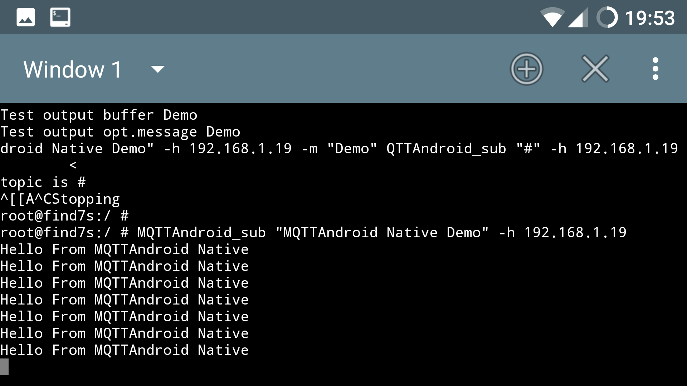

```
$$\      $$\  $$$$$$\ $$$$$$$$\ $$$$$$$$\  $$$$$$\                  $$\                     $$\       $$\ 
$$$\    $$$ |$$  __$$\\__$$  __|\__$$  __|$$  __$$\                 $$ |                    \__|      $$ |
$$$$\  $$$$ |$$ /  $$ |  $$ |      $$ |   $$ /  $$ |$$$$$$$\   $$$$$$$ | $$$$$$\   $$$$$$\  $$\  $$$$$$$ |
$$\$$\$$ $$ |$$ |  $$ |  $$ |      $$ |   $$$$$$$$ |$$  __$$\ $$  __$$ |$$  __$$\ $$  __$$\ $$ |$$  __$$ |
$$ \$$$  $$ |$$ |  $$ |  $$ |      $$ |   $$  __$$ |$$ |  $$ |$$ /  $$ |$$ |  \__|$$ /  $$ |$$ |$$ /  $$ |
$$ |\$  /$$ |$$ $$\$$ |  $$ |      $$ |   $$ |  $$ |$$ |  $$ |$$ |  $$ |$$ |      $$ |  $$ |$$ |$$ |  $$ |
$$ | \_/ $$ |\$$$$$$ /   $$ |      $$ |   $$ |  $$ |$$ |  $$ |\$$$$$$$ |$$ |      \$$$$$$  |$$ |\$$$$$$$ |
\__|     \__| \___$$$\   \__|      \__|   \__|  \__|\__|  \__| \_______|\__|       \______/ \__| \_______|
                  \___|                                                                                   
                                                                                                          
                                                                                                          
                  $$\   $$\            $$\     $$\                      $$\                               
                  $$$\  $$ |           $$ |    \__|                     $$ |                              
                  $$$$\ $$ | $$$$$$\ $$$$$$\   $$\ $$\    $$\  $$$$$$\  $$ |                              
                  $$ $$\$$ | \____$$\\_$$  _|  $$ |\$$\  $$  |$$  __$$\ $$ |                              
                  $$ \$$$$ | $$$$$$$ | $$ |    $$ | \$$\$$  / $$$$$$$$ |\__|                              
                  $$ |\$$$ |$$  __$$ | $$ |$$\ $$ |  \$$$  /  $$   ____|                                  
                  $$ | \$$ |\$$$$$$$ | \$$$$  |$$ |   \$  /   \$$$$$$$\ $$\                               
                  \__|  \__| \_______|  \____/ \__|    \_/     \_______|\__|                              
                                                                                                    

```
##Summary##

**Compile and run MQTT based clients on android!**

       **Target Android API 5.5 and Above**


####What is MQTT?####

MQTT is a machine-to-machine (M2M)/"Internet of Things" connectivity protocol.
It was designed as an extremely lightweight publish/subscribe messaging transport. It is useful for connections with remote locations where a small code footprint is required and/or network bandwidth is at a premium. For example, it has been used in sensors communicating to a broker via satellite link, over occasional dial-up connections with healthcare providers, and in a range of home automation and small device scenarios. It is also ideal for mobile applications because of its small size, low power usage, minimised data packets, and efficient distribution of information to one or many receivers. 

####What is MQTTAndroidNative?####

MQTTAndroidNative is a tiny build enviroment that allows you to create custom C source code for implementing
MQTT based client applications and compile it for native use on your android device. 
MQTTAndroidNative uses eclipses paho.mqtt.c available at: [paho.mqqt.c](https://github.com/eclipse/paho.mqtt.c"Github Link") 
as a template and customises the compilation process to build the android native libraries needed to execute custom MQTTAndroid Native C code.


####Why what for?####

* Well first of all its pretty cool!
* Second MQTT is quite Interesting to android developers who are focusing on Internet of things applications
* Third Its a very intersting addidtion to the standard busybox tools available for android.
* Last but not least, It can be a nice consideration for fellow GREY HAT'S that are currently in the process of   planning and   developing their next projects aimed at taking over the World!      


##Demo##

What good is all the talk without a demonstration right? 
Well here it is a simple Proof of Concept and How to..........

Fire up a console and start your mosquitto broker 


As you can see have a broker running at localhost!
We want to test: 

* MQTTAndroid_pub 
* MQTTAndroid_sub

These 2 cli tools are responsible to subscribe and and  publish to certain topics!
We will start with MQTTAndroid_pub which will publish a message to broker and hopefully the we will be able to 
capture the published message on our local PC.

**Tip** 
For usage and additional parameters to the app issue

```
MQTTAndroid_pub 

```

This will out put the applications help menu and exit


Now lets look at a proper example!

On the Android device we are issuing the following command!

```
MQTTAndroid_pub "MQTTAndroid Native Demo" -h 192.168.1.19 -m "demo

```


on our host Machine we execute 

```
mosquitto_sub -t "#"   

```


If you have entered the above command into your Android device and pressed enter
the tool will respond with this output!


But more importantly if you look at your host machines terminal you can see that Your device has successfully published a message to the broker and your host has captured it!


If you want to test MQTTAndroid_sub simply follow the same procedure! Here is some output I captured with MQTTAndroid_sub



##Installation##

**Basic Instructions No root required**

* Download Fredrik Fornwall's Termux app from Google PlayStore!
  [termux.apk](https://play.google.com/store/apps/details?id=com.termux&hl=en"Download Link") 
  
**NOTE**
(_Even if you do not plan to use MQTTAndroidNative Go on and Download Fredrik Fornwall's amazing Termux app anyway and be Amazed_)

Follow the Instructions within the app to install the System and use the
package manager to install:

* gcc
* openssl
* openssl-dev
* openssl-tool
* git


**Additionaly add tsu (Root Required for this feature!)**

You Can add an extra feature to termux by downloading "tsu" short for termux su which elevates privileges for those who want to use use termux as root!
[tsu](https://github.com/cswl/tsu"You can check it out here!") 


##MqttAndroid Native  Setup## 

Now lets setup termux so we can start building our first test client!

Create a directory call it git or whatever you wish!

```
mkdir git

```

change your current directory to the the one you have just created!


```
cd git

```

Now clone the MQTTAndroid Native repository into this folder!

```
git clone https://github.com/RogueFendor/MQTTAndroidNative.git

```

Now change your current Directory again and enter into the new freshly cloned directory folder

```
cd MQTTAndroidNative

```

Here you find 4 Directories

* bin
* src
* workspace(_within src_)
* lib

* The **bin** Directory is a suggested directory for your compiled sources i.e
  binaries. You can use your own locations if you wish.

* The **src** Directory contains important headers and sources required for the 
  basic compilation **Do not temper here unless you know what you are doing**

* The **workspace** Directory is again just a suggested Directory for your
   MQTT implementations again change freely as you wish.


* The **lib** Directory will contain all Shared objects required for your
  implementations! 

**WARNING!**
The compile script is using this folder to output al
compiled shared objects do not temper here either!


##Compile your Sources! No root required##

1. Create a C MQTT client:

```
vim src/workspace/MyFirstMQTTClient.c

```

Copy and paste this Code! Happily borrowed from paho :-)


```
#include "stdio.h"
#include "stdlib.h"
#include "string.h"
#include "MQTTClient.h"

#define ADDRESS     "<change this to the adress of your broker and port default is 1883>"
#define CLIENTID    "ExampleClientPub"
#define TOPIC       "MQTT Examples"
#MQTTAndroidNative.define PAYLOAD     "Hello World!"
#define QOS         1
#define TIMEOUT     10000L

int main(int argc, char* argv[])
{
    MQTTClient client;
    MQTTClient_connectOptions conn_opts = MQTTClient_connectOptions_initializer;
    MQTTClient_message pubmsg = MQTTClient_message_initializer;
    MQTTClient_deliveryToken token;
    int rc;

    MQTTClient_create(&client, ADDRESS, CLIENTID,
        MQTTCLIENT_PERSISTENCE_NONE, NULL);
    conn_opts.keepAliveInterval = 20;
    conn_opts.cleansession = 1;

    if ((rc = MQTTClient_connect(client, &conn_opts)) != MQTTCLIENT_SUCCESS)
    {
        printf("Failed to connect, return code %d\n", rc);
        exit(-1);
    }
    pubmsg.payload = PAYLOAD;
    pubmsg.payloadlen = strlen(PAYLOAD);
    pubmsg.qos = QOS;
    pubmsg.retained = 0;
    MQTTClient_publishMessage(client, TOPIC, &pubmsg, &token);
    printf("Waiting for up to %d seconds for publication of %s\n"
            "on topic %s for client with ClientID: %s\n",
            (MyfirstClientint)(TIMEOUT/1000), PAYLOAD, TOPIC, CLIENTID);
    rc = MQTTClient_waitForCompletion(client, token, TIMEOUT);
    printf("Message with delivery token %d delivered\n", token);
    MQTTClient_disconnect(client, 10000);
    MQTTClient_destroy(&client);
    return rc;
}

```

2. Compile th Sources  

Now its time to compile our client. Compilation is made easy with the
compiler helper script

execute:

```
chmod +x compiler.sh

```

This will make our script executable!

Now type the command:

```
./compiler.sh bin/MyClient src/workspace/MyfirstClient.c

```

compile.sh is a simple shell script  that accepts 2 arguments:

* First argument is the output location of the final binary.
* Second argument provides the location of your sources!


Once you have executed the compile.sh you will see quite alot of output dont worry too much this is normal. 
Now if everything went well you will have successfullly compiled your first MQTTclient!

You can Check has everything correctly compiled by looking into the bin
directory

```
ls bin/

```

You shoud have an output similiar to this one:

```
$ ls bin/
android_client

```

Congratulations you have succesfully compiled an MQTTClient from source for
your Android Device that can run natively on your Android Device!


##Executing and testing the Client##

Now that you have compiled the MQTTClient its time We test it!

I provided a very simple exec script exec.sh this script handles
LD_LIBRARY_PATH which was quite a pain in the arse! This script takes the path
to the binary to be executed as an argument and exports the enviroment
variables for the shared Objects library run this script by entering:

```
chmod +x exec.sh
./exec.sh bin/MyfirstClient

```

Voila it runs!


##Additional Hacks.. Root Required##

We are using Fredrik Fornwall's amazing....
[termux.apk](https://play.google.com/store/apps/details?id=com.termux&hl=en "Termux") 
 available from the Google PlayStore, To build our binaries.
 But that does not mean we can only execute these binaries from this app.

####How To make MQTT clients System Wide Available####

On Android devices we have basically two Options to execute and run applications

Deploy your files in:

1. /data/data directories
2. /system/bin directory

Be aware that the library paths have to to be exported if you want to deploy and run you code in custom locations. the way MQTTAndroid Native handles this at present is to just export the path to these libraries
i.e

```
export LD_LIBRARY_PATH="lib/"

```
just change "lib/" to path/to/your/lib

But If you want your Client to be available System wide just copy all files in the lib folder to your
Android Device to system/lib  

```
tsu

cp -r lib/* /system/lib/

```

And copy you executable binary to /System/bin

```
cp <the name of your file> /system/bin

```

Or do it Manually with a file browser of your choice by selecting and copy and pasting files into their
appropiate locations.
Be aware that you will need a file browser that has access to the Android root file system.

If you are lazy and don't want to go through all this by yourself... Don't worry you can just
run my support script and it will take of it for you!

Simply Execute Iam_lazy.sh and it will do the rest.

```
chmod +x Iam_lazy.sh
tsu
./Iam.lazy.sh <path to bin>

```


HAPPY HACKING!


